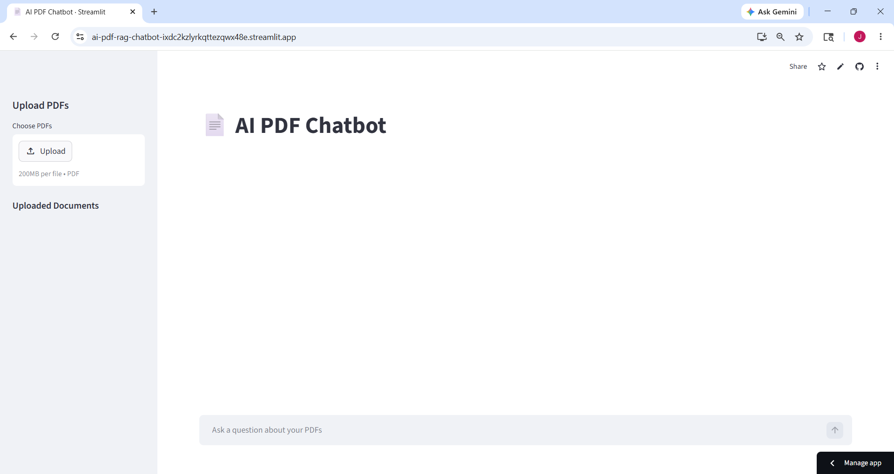
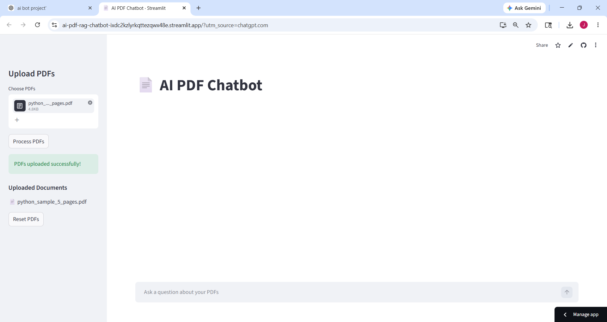
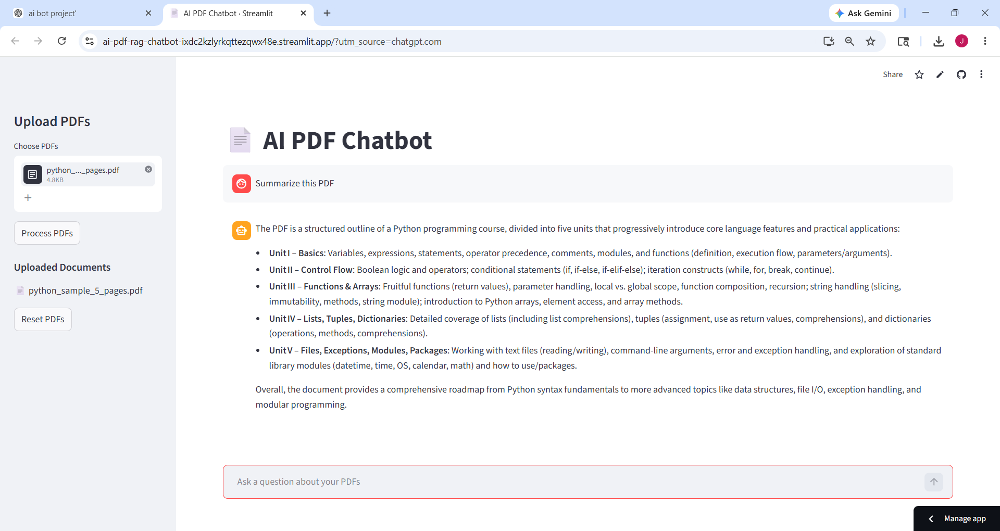

# AI PDF Chatbot

An AI-powered PDF question-answering chatbot built using FastAPI, Streamlit, FAISS, and OpenRouter LLM APIs.

---

## Features

- Upload multiple PDFs
- Ask questions from uploaded documents
- Retrieval-Augmented Generation (RAG)
- Semantic search using embeddings
- FAISS vector database
- FastAPI backend
- Streamlit frontend
- Deployed on Render and Streamlit Cloud

---

## Tech Stack

- Python
- FastAPI
- Streamlit
- FAISS
- OpenRouter API
- OpenAI SDK
- PyPDF
- LangChain Text Splitters
- NumPy

---

## Project Architecture

```text
PDF Upload
    ↓
Text Extraction
    ↓
Chunking
    ↓
Embeddings Generation
    ↓
FAISS Vector Store
    ↓
Semantic Retrieval
    ↓
LLM Response Generation
```

---

## Live Demo

### Frontend
https://ai-pdf-rag-chatbot-ixdc2kzlyrkqttezqwx48e.streamlit.app

### Backend
https://ai-pdf-rag-backend.onrender.com

---
## Screenshots

### Home Screen


### PDF Uploaded


### Chat Response


---

## Installation

### Clone Repository

```bash
git clone https://github.com/abhinaya06-tech/ai-pdf-rag-chatbot.git
cd ai-pdf-rag-chatbot
```

---

## Install Dependencies

```bash
pip install -r requirements.txt
```

---

## Environment Variables

Create a `.env` file in the root directory:

```env
OPENROUTER_API_KEY=your_api_key_here
```

---

## Run Backend

```bash
cd backend
uvicorn app:app --reload
```

Backend runs on:

```text
http://127.0.0.1:8000
```

---

## Run Frontend

```bash
streamlit run frontend/streamlit_app.py
```

Frontend runs on:

```text
http://localhost:8501
```

---

## API Endpoints

### Upload PDF

```http
POST /upload-pdf
```

### Ask Questions

```http
POST /ask
```

Example request:

```json
{
  "question": "What is Python?"
}
```

---

## Folder Structure

```text
ai-pdf-chatbot/
│
├── backend/
│   ├── app.py
│   ├── pdf_loader.py
│   ├── chunking.py
│   ├── embeddings.py
│   ├── retriever.py
│   ├── vector_store.py
│   └── llm.py
│
├── frontend/
│   └── streamlit_app.py
│
├── data/
├── requirements.txt
├── render.yaml
└── README.md
```

---

## Future Improvements

- Add source citations
- Conversational memory
- Authentication system
- Chat history persistence
- PDF preview support
- Better UI/UX
- Multi-user support
- Docker deployment

---

## Author

Abhinaya

GitHub:
https://github.com/abhinaya06-tech
